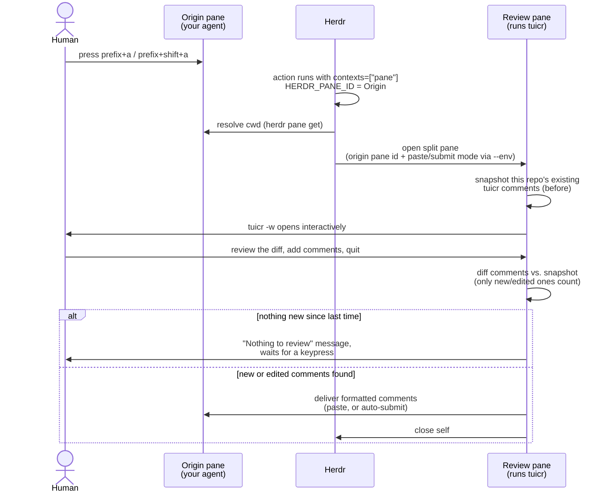

# herdr-tuicr

A [Herdr](https://herdr.dev) plugin that runs [`tuicr`](https://github.com/agavra/tuicr) code review in a split
pane and automatically hands the finished review back to whichever agent pane
opened it — no manual copy/paste, no blocking agent tool call.

> **⚠️ Early alpha.** This plugin is under active development; anticipate
> breaking changes.

## Why

tuicr already ships a Herdr wrapper script
(`skills/tuicr/tuicr-wrapper-herdr.sh`), but it is agent-invoked: a coding
agent has to run it via a tool call and block its own turn waiting for tuicr
to exit. This plugin moves the same "open tuicr in a split, wait for exit"
flow behind a hotkey handled entirely by Herdr, and — because a plugin action
with `contexts = ["pane"]` receives the exact invoking pane in
`HERDR_PANE_ID` — sends the finished review back to precisely the pane that
opened it, even with several agent panes open at once.

Two hotkeys are provided:

- **paste** — inserts the formatted comments into the origin pane's input;
  you press Enter.
- **submit** — inserts and submits automatically.

## How it works



The origin pane is the exact pane that had focus when you pressed the hotkey
— not a same-tab guess — so this works correctly even with several agent
panes open across different repos at once. Because tuicr keeps a review
session around until you commit your changes, reopening tuicr on an
unchanged diff shows your earlier comments again; the "diff comments vs.
snapshot" step is what stops those from being re-sent to the agent a second
time.

## Requirements

- Herdr >= 0.8.0
- `tuicr` on `PATH`
- `jq` on `PATH`

## Install

```sh
herdr plugin link /path/to/herdr-tuicr
```

Or, once published:

```sh
herdr plugin install ekropotin/herdr-tuicr
```

## Configure hotkeys

Add to `~/.config/herdr/config.toml`:

```toml
[[keys.command]]
key = "prefix+a"
type = "plugin_action"
command = "ekropotin.herdr-tuicr.review-paste"
description = "tuicr review (paste)"

[[keys.command]]
key = "prefix+shift+a"
type = "plugin_action"
command = "ekropotin.herdr-tuicr.review-submit"
description = "tuicr review (auto-submit)"
```

Then `herdr server reload-config`.

Pick keys that are free in *your* config: `prefix+r`/`prefix+shift+r` look
tempting but are Herdr's built-in `resize_mode`/`reload_config` — check
`herdr --default-config` and your own `[[keys.command]]` entries before
binding.

## Configure the plugin

Copy [`config.toml.example`](./config.toml.example) to
`$(herdr plugin config-dir ekropotin.herdr-tuicr)/config.toml` and edit. See
that file for the available keys (currently just which side the review pane
opens on).

## Usage

1. With an agent running in a pane, press the bound hotkey.
2. A `tuicr` review pane opens, scoped to that pane's working directory and
   the uncommitted working-tree diff (`tuicr -w`).
3. Review, add comments, quit with `:q` (current tuicr versions disable plain `q`).
4. The review pane closes itself and the formatted comments land in the
   input of the exact pane that triggered the review — pasted or
   auto-submitted depending on which hotkey you pressed.

If nothing was flagged and every file was reviewed, nothing is sent — tuicr's
own `reviewed_count`/`file_count` fields are used to tell "clean review" apart
from "human quit early", so a merely-clean pass never sends a confusing empty
message.

If the tuicr session can't be unambiguously identified when the pane closes
(rare — e.g. two sessions active for the same repo with neither marked
`active`), the review pane is left open with a diagnostic instead of closing
silently; close it by hand once you've read it.

## Development

```sh
tests/run.sh
```

runs the formatting/session-selection unit tests (pure bash + jq, no Herdr or
tuicr binary required).
